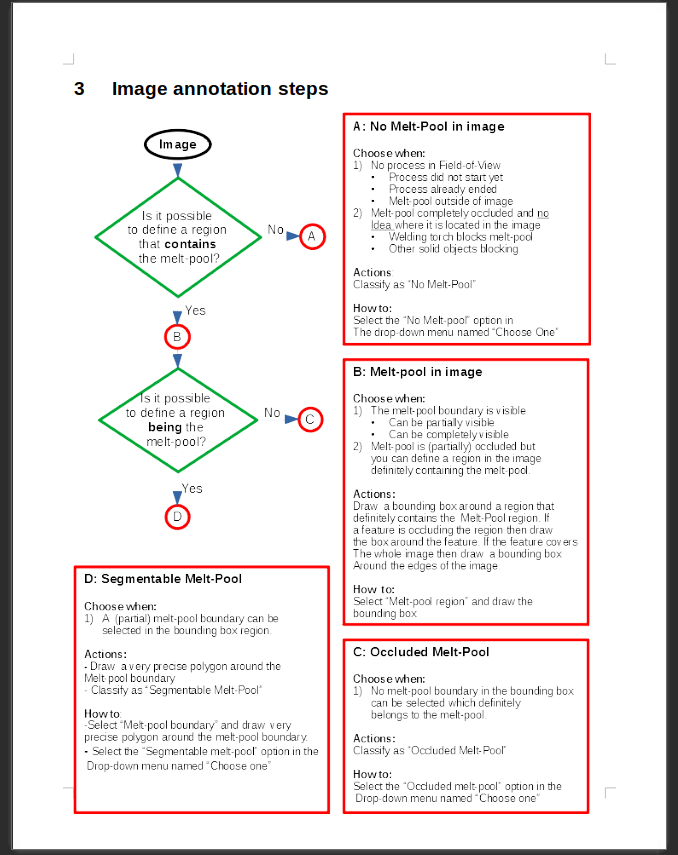

# Hi 1X!

I have known for a while that at some point I needed to show a bit more of myself 
to the world in terms of personal information as well as projects on Github . 
Working and completing a PhD has however kept me from it. More information about 
me and what I love to do can be found [here](/ABOUT). This is my new, long overdue, 
webpage I created in response to your opportunity. This specific page is made for 
you and can only be accesed if you know the URL. Keep that in mind when you start 
exploring this webpage. I hope you like it! The startpage can be found [here](https://gijsvanhoutum.github.io/).

Although there is already plenty to explore on this webpage, it is still far from
complete as only a handfull of personal projects were added that I could find and
brush up during this short period. I therefore try to take it to the next step on 
this page and provide more in depth information regarding some of my work.

As most of my work is confidential, I added a couple of [papers](/PAPERS) 
and [projects](/PROJECTS) to this website. They are by no means complete nor 
perfect. They are however examples of writing and work samples that I can share. 
Although they provide some insights in some small personal coding projects
they do not really represent my work. I therefore thought it would be good to 
describe a specific work project in detail.

I am very excited about the opportunity as a Senior Computer Vision Engineer at 1X. 
Therfore I hope my efforts live up to the provided task at hand. Let's go!

# Robotic welding Melt-pool AI tool

From 2019 to 2021 I have worked on project bases for a company called Xiris. 
This project covers the investigation, writing and work sample in my opinion. It 
is also a good representation of my work for other companies. The order in which the 
samples are discussed, is however reversed, as any project should start with
an investigation first, followed by documentation, and at last the work itself in 
my opinion.

## Problem definition

This project at Xiris started with a specific problem they faced. Xiris makes 
industrial camera's for the manufacturing industry in general, but specifically 
for the welding and additive manufacturing industry. These camera's are expensive
but able to handle heat and bright operating conditions. Besides hardware, they
make their own software application that allows camera control in terms of shutter
time, region-of-interest and so on. Specific Zeiss optics are used for focusing.
Please play the video below to get an idea of their XVC-1000 camera and software.

<iframe 
        width="560" 
        height="315" 
        src="https://www.youtube.com/embed/io-OjiepsVo?si=-jsijsSrsv4eJXKI" 
        title="YouTube video player" 
        frameborder="0" 
        allow="accelerometer; autoplay; clipboard-write; encrypted-media; gyroscope; picture-in-picture; web-share" 
        allowfullscreen
></iframe>

Some of their customers ask for specific computer vision algorithms that
detect objects or measure certain area's in the camera field-of-view specific to
their applications. At Xiris, their software stack is pure C++ OpenCV. They build
their own SDK around it and use it create these novel algorithms. For the last 
couple of years they have used the conventional/classical computer vision algorithms
to solve most of their problems. Thresholding, Watershed, Contours, Canny-edge are all
things they make use of.

Xiris had many customers asking for a tool that could segment the melt-pool in real-time 
such that its geometry could be measured and possible controlled in the future. 
This type of measurement proved to be difficult using conventional approaches. They
essentially tried everything in the [Szeliski](https://szeliski.org/Book/) computer vision book. 
With this problem they approached me and asked me if I could solve this problem for them
using any of the novel computer vision methods as their own solutions led to errornous
predictions which were leading to bad melt-pool measurements. 

## Investigation and documentation

At that point I started with thorough conversations on-site in Burlington, Ontario, Canada 
to discuss their needs:
- If they had any pre-recorded footage to learn from.
- What they had done and tried in the past to solve the problem
- The needs of their customers
- The needs of Xiris itselfs
- Chat with welding experts to discuss the process and what should be observed
- Chat with Xiris software engineers about how they deploy algorithms.

I normally use a specific template that I use for documentation and the planning of my projects. 
The work is normally split into work packages (WP) and tasks are assigned to the people involved
with the project. A timeline is established, and a project scope is made. A piece of the initial
Xiris project is shown below. 

Every month I generally create a new updated progress report normally with an update on the timeline and
project scope. The scope changes as newly found information might affect the direction
of certain project aspects. Most projects have the follwing steps included.

WP1: Dataset development:
- Exploratory data analysis 
- Annotation protocol development
- Cost and time planning for annotation
- Training of personnel for annotation
- Weekly annotation review sessions and workshops to discuss progress/problems.

WP2 Model development: 
- Data pipeline development
- Architecture(s) development
- Training and testing development
- Metric and validation development
- Visualization and documentation

WP3 Deployment:
- Model deployment into customer software.
- On device testing.
- Documentation
- Knowledge transfer

During this project it became clear quite early on that we would take a 
supervised learning approach instead of unsupervised. This has mainly todo with my
experience that supervised approaches generally lead to better results. 
Furthermore, robustness was an issue, and we decided that an Single-Input-Multiple-Output
(SIMO) system was necessary with combined segmentation and classification capabilities.
The task of the classification head would be to determine whether the quality of the
observed visuals was sufficient enough to be segmented. The segmentation head would then
segment the image. Each image had to be classified in either having No-meltpool, an Occluded
melt-pool or a Segmentable melt-pool.

## Creating Quality Datasets is Hard

The creation of a qualitative dataset is however where most of my time is spent
during any of my projects. I reckon about 80-90 % of my time is spent creating
quality datasets. Annotation in the form of classification and segmentation
does however take time. Have 3 classes and object segmentation I decided to start
with a dataset of at least 10,000 images to be annotated. After several annotation
trails with different human annotaters I calculated that we would need about 6 months
to complete the task. We ended up have a team of about 10 annotators. I had good contact
with a professional data annotation company called Labelbox in the US. I used their suite
for annotation.

With 10 annotators from different disciplines I created an annotation project team. 
Welders, Sales people, Co-op students, they were all part of the project. I would train them
on the annotation protocol that I developed. It is a step by step flowchart that serves
as a initial starting point for annotators. Especially when new annotators would join 
the project and needed guidance. The different levels of experience in annotators was also
a problem. I therefore normally have weekly workshops and video-chat discussions with the
annotation teams to discuss difficulties and provide the ability to learn from one another.
Also every annotated image can only be accepted if it is reviewed and accepted by
some of the most experienced annotators. 

It might seem overkill, but real practical industry projects is more about the data 
and people than it is about the modelling. This is something that is ignored at University. 
In my opinion most critical things about machine learning are not taught. That is also
why I normally have bachelor or master students as being part of my projects. They 
get to experience real-world machine learning problems instead of Kaggle experience
or projects working on data created under sub-optimal conditions in a lab.

What data instances do you select for annotation? Always a good question. At university
courses the topic of selecting a subset of data from a larger dataset is often overlooked.
The goto solution is often just using uniform random sampling.
In most cases that is a very bad choice in my experience. Real-world datasets 
are sparse, non-diverse and tend to have large local clusters with redundant data. 
First of all, what if most of you data instances are very similar to one another? 
Annotating one of them would probably be enough. In this case there was plenty of 
redundancy and we needed a better method of selecting the data instances to be annotated. 
At this point I determined that we needed an active learning algorithm to guide our way through annotation. 

The need for active learning is a recurring subject in many of my projects. 
With the use of active learning we annotated 10,000 selected images out of a pre-selected
300 customer videos from 50 different customers/welding machines with a total of about 2,000,000 images.
Since I am also pursueing a PhD, I decided to write a paper about a novel active
learning query strategy which is pratical, has low computation complexity and 
is applicable to any type of machine learning dataset. The University
was also very excited and decided to fund me to get it Patented. Please check out 
my paper [AWUS: Adaptive Weighted Uncertainty Sampling](https://github.com/gijsvanhoutum/awus).
Using active learning you can heavily reduce the annotation need.

## Modelling

In parallel to the annotation, I started working on the development side along with
some masters and bachelor students. I normally experience that starting with 
relatively simple and tested architectures which you modify and tailor to the 
specific applications is the best starting point for any project. Spending 90% 
of your time on the dataset and 10% on the modelling aspect normally leads to 
better performance than spending it 50-50 anyways. 

Another important aspect are some resource constraints. Xiris has customers who
run their software on their own computers. If they suddenly neede to purchase a
GPU of 2,000 Dollars just to run this new algorithm, nobody would buy it. 
They therefore asked for a solution which would run at more 30 frames per second
on the CPU. These constraints are often overlooked in the academic world of
computer vision in my experience. 

Fancy algorithms or architectural tricks seem nice but often add complexity and are
as a result often slow. Also, many operations are still not supported by model optimizers. 
Tensorflow Lite can be are real pain in the ass in that regard. MobileNets are 
generally good backbones to start with as they are well supported and relatively fast 
on the CPU as well as the GPU. 

Than there is the transformer hype. Do not get me wrong, transformers are great.
I love them in many applications. In recurrent video object segmentation they are 
however a different story. State-space models have a fixed size state in space and time
normally. LSTM's or GRU's are good examples of that. Using a transformer for this task
generally leads to performance improvements but adds complexity. Also, storing all past 
predictions in memory and attending to all of it at every time-step is not really
memory efficient. So the question is, what past predictions do you store? Saving all 
of them in memory is impossible, so we need to make a selection. 

At Xiris I decided to start with a Recurrent U-Net approach and work from there. 
For recurrence I use a GRU, the encoder was a pre-trained MobileNetV2 on ImageNet and
the two-headed decoder was trained from scratch on our new dataset. Data augmentation
in terms of geometrical transformations was used and the implementation
was written in pure Tensorflow using Keras only for some layers of the network i.e backbone. 
Tensorflow is relatively ease when using Keras, but anything custom requires
a deeper understanding of Tensorflow in general and how you should develop in it 
in my opinion. I have worked with Tensorflow for years now. I avoid Keras as most as 
possible normally. I optimized and pruned the model using the build in Tensorflow 
optimization methods. For deployment I transformed the model to ONNX to be able to
import it in OpenCV. I Wrote some inference code in C++ to the model performance

An example video of the initial implementation. 
<iframe 
        width="560" 
        height="315" 
        src="https://www.youtube.com/embed/19c1h6Nx0Eo?si=1y6ltlclLGBvwKGh" 
        title="YouTube video player" 
        frameborder="0" 
        allow="accelerometer; autoplay; clipboard-write; encrypted-media; gyroscope; picture-in-picture; web-share" 
        allowfullscreen
></iframe>

Eventually, after some iterations of model development we came to a final
solution which they integrated as part of their system. Please see it at work below.

<iframe 
        width="560" 
        height="315" 
        src="https://www.youtube.com/embed/5nGvS_Rs-aA?si=2V69MGk0hBPWx2Wf" 
        title="YouTube video player" 
        frameborder="0" 
        allow="accelerometer; autoplay; clipboard-write; encrypted-media; gyroscope; picture-in-picture; web-share" 
        allowfullscreen
></iframe>

