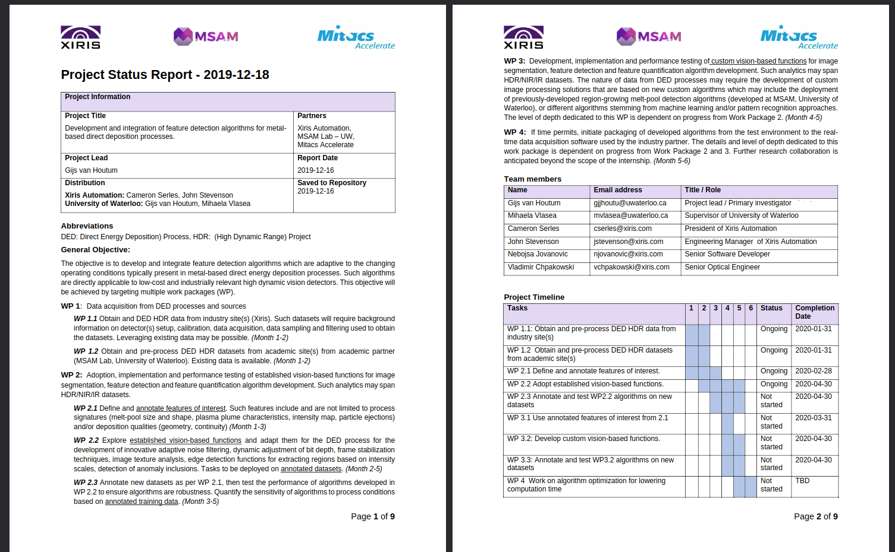
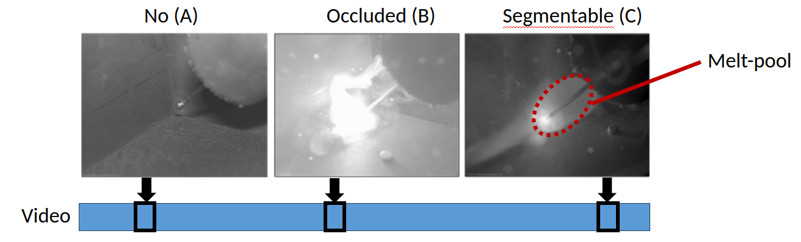
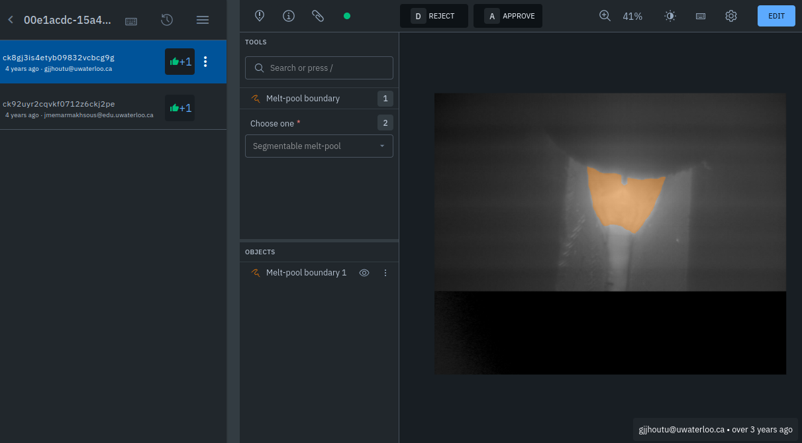

# Hi 1X!

I have known for a while that at some point I needed to show a bit more of myself 
in terms of personal information as well as projects on Github to the world. 
Working and completing a PhD in my spare time has however kept me from it. More
personal information can be found [here](/ABOUT).

This is my new, long overdue, webpage I created in response to your opportunity. 
This specific page is made for you and can only be accesed if you know the URL. 
So keep that in mind when you start exploring this webpage. I hope you like it!
The startpage can be found [here](https://gijsvanhoutum.github.io/).

Although there is already plenty to explore on this webpage, it is still far from
complete as only a handfull of personal projects were added that I could find and
brush up during this short period. I therefore try to take it to the next step on 
this page and provide more in depth information regarding some of my work.

I am very excited about the opportunity as a Senior Computer Vision Engineer at 1X. 
Therfore I hope my efforts live up to the provided task at hand. Let's go!

As most of my work is confidential, I added a couple of [papers](/PAPERS) 
and [projects](/PROJECTS) to this website. They are by no means complete nor 
perfect. They are however examples of writing and work samples that I can share.

Although they provide some insights in some small personal coding projects
they do not really represent my work. I therefore thought it would be good to 
describe a specific work project in detail without violating the NDA. 

# Robotic welding Melt-pool AI tool

From 2019 to 2021 I have worked on project bases for a company called Xiris. 
This project covers the investigation, writing and work sample in my opinion. It 
is also a good representation of my work for other companies. The order in which the 
samples are discussed, is however reversed, as any project should start with
an investigation first, followed by documentation, and at last the work itself in 
my opinion.

This project at Xiris started with a specific problem they faced. Xiris makes 
industrial camera's for the manufacturing industry in general, but specifically 
for the welding and additive manufacturing industry. These camera's are expensive
but able to handle heat and bright operating conditions. Besides hardware, they
make their own software application that allows camera control in terms of shutter
time, region-of-interest and so on. Specific Zeiss optics are used for focusing.

Please play the video below to get an idea of their XVC-1000 camera and software.

<iframe 
        width="560" 
        height="315" 
        src="https://www.youtube.com/embed/io-OjiepsVo?si=-jsijsSrsv4eJXKI" 
        title="YouTube video player" 
        frameborder="0" 
        allow="accelerometer; autoplay; clipboard-write; encrypted-media; gyroscope; picture-in-picture; web-share" 
        allowfullscreen
></iframe>

Some of their customers ask for specific computer vision algorithms that
detect objects or measure certain area's in the camera field-of-view specific to
their applications. At Xiris, their software stack is pure C++ OpenCV. They build
their own SDK around it and use it create these novel algorithms. For the last 
couple of years they have used the conventional/classical computer vision algorithms
to solve most of their problems. 

Xiris had many customers asking for a tool that could segment the melt-pool in real-time 
such that its geometry could be measured and possible controlled in the future. 
This type of measurement proved to be difficult using conventional approaches. They
essentially tried everything in the [Szeliski](https://szeliski.org/Book/) computer vision book. 
With this problem they approached me and asked me if I could solve this problem for them
using any of the novel computer vision methods as their own solutions led to errornous
predictions which were leading to bad melt-pool measurements. 

At that point I started with thorough conversations on-site in Burlington, Ontario, Canada 
to discuss their needs:
- If they had any pre-recorded footage to learn from.
- What they had done and tried in the past to solve the problem
- The needs of their customers
- The needs of Xiris itselfs
- Chat with welding experts to discuss the process and what should be observed
- Chat with Xiris software engineers about how they deploy algorithms.

I normally use a specific template that I use for documentation and the planning of my projects. 
The work is normally split into work packages (WP) and tasks are assigned to the people involved
with the project. A timeline is established, and a project scope is made. A piece of the initial
Xiris project is shown below. 

Every month I generally create a new updated progress report normally with an update on the timeline and
project scope. The scope changes as newly found information might affect the direction
of certain project aspects. Most projects have the follwing steps included.

WP1: Dataset development:
- Exploratory data analysis 
- Annotation protocol development
- Cost and time planning for annotation
- Training of personnel for annotation
- Weekly annotation review sessions and workshops to discuss progress/problems.

WP2 Model development: 
- Data pipeline development
- Architecture(s) development
- Training and testing development
- Metric and validation development
- Visualization and documentation

WP3 Deployment:
- Model deployment into customer software.
- On device testing.
- Documentation
- Knowledge transfer

During this project it became clear quite early on that supervised learning using
a type of recurrent convolutional neural network would be the starting point we would work from.
Furthermore, robustness was an issue, and we decided that an Single-Input-Multiple-Output
(SIMO) system was necessary with combined segmentation and classification capabilities.
The task of the classification head would be to determine whether the quality of the
observed visuals was sufficient enough to be segmented. The segmentation head would then
segment the image. Each image had to be classified in either having No-meltpool, an Occluded
melt-pool or a Segmentable melt-pool.

The creation of a qualitative dataset is however where most of my time is spent
during any of my projects. I reckon about 80-90 % of my time is spent creating
quality datasets. Annotation in the form of classification and segmentation
does however take time. Have 3 classes and object segmentation I decided to start
with a dataset of at least 10,000 images to be annotated. After several annotation
trails with different human annotaters I calculated that we would need about 6 months
to complete the task. We ended up have a team of about 10 annotators. I had good contact
with a professional data annotation company called Labelbox in the US. I used their suite
for annotation.

What data instances do you select for annotation? Always a good question. At university
classes on machine learning they always use uniform random sampling. In most cases
that is a very bad choice. First of all, what if most of you data instances are very
similar to one another? Annotating one of them would be enough. In this case
there was plenty of redundancy and we needed a better method of selecting the data
instances to be annotated. At this point I determined that we needed an active learning
algorithm to guide our way. 

See my paper and patented active learning algorithm [here](https://github.com/gijsvanhoutum/awus)
that I developed during this project.

Annotation took about 6 months and I eventually created an

## Writing Sample

## Work Sample

