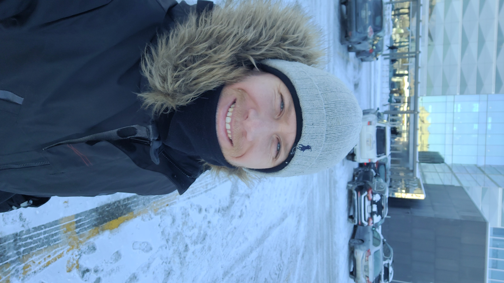
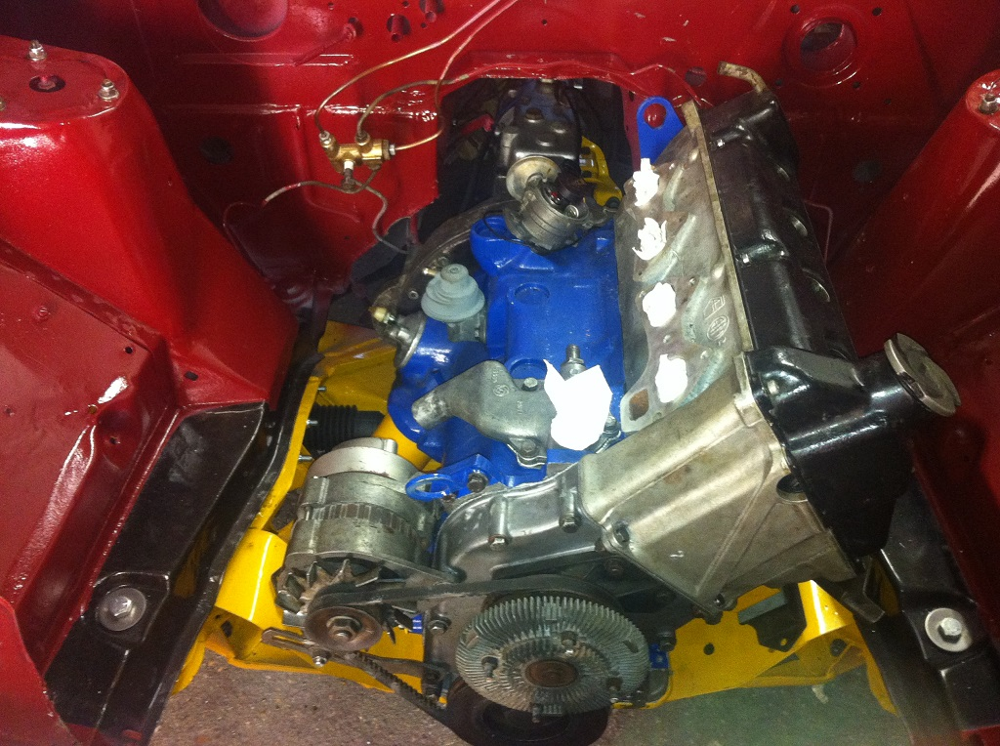
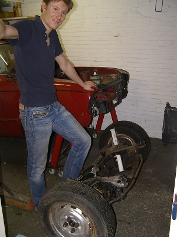
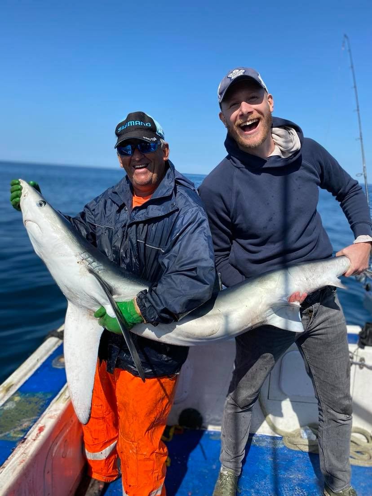

## Portfolio

Hi there! Welcome to my personal webpage at [https://gijsvanhoutum.github.io/](https://gijsvanhoutum.github.io/)

I am Gijs van Houtum, a passionate computer vision software engineer/applied scientist. 
I love to write software, develop new algorithms and create awesome machine learning solutions. 
Above all, I just love to make stuff work!

In the last 7+ years I have helped over 5 different companies with newly developed computer vision solutions.
My work has predominately been focused towards creating smart deep learning based computer vision algorithms 
for the manufacturing industry. Quality monitoring has been the main task of these algorithms I built.
The main goal is to help and push the manufacturing industry to Industry 5.0 eventually, using these smart solutions! 

I am also pursueing a PhD in industrial AI (finished Mar-2024) at the University of Waterloo in Canada. 
During my work, I noticed the demand for smart solutions based on machine learning within the manufacturing industry, 
and specifically the Metal Additive Manufacturing Industry. Recurring problems from company to company created a personal vision and interest in the creation of 
data-efficient machine learning solutions. Practical experience with AI has taught me the importance of qualitative datasets
used for training as well as validation. Creating them is however time consuming, difficult and expensive. My PhD is 
therefore focused on creating awesome solutions that require less data to be annotated, and adaptive machine learning models, 
that are task invariant.

In my spare time I love to write software and restore old motorcycles/cars with my dad. 
During holidays I like to explore, hike, ski or sail the seas.

Some pictures of me in my natural habitat! And yes, the shark is still alive!

  
  

  
  

  
  

Please see this very old blog, that desperately needs an update, of my 1974 Triumph Dolomite Sprint
I have been restoring for the last 10 years. 

[Dolly Sprint Page](https://forum.triumphdolomite.co.uk/viewtopic.php?t=20033)

Also, in the past I have been working on DIY electronic fuel injections systems. They are common on 
cars, but not on mopeds. So lets make it happen! I took an old Austrian Puch Maxi and started the
conversion... Hardware, Electronics, Software. It is all there! Check out some very
old Youtube videos with the lowest resolution video you have ever seen!

[EFI Puch Maxi](https://www.youtube.com/@TheYamahaxt500)

<!-- ### Installation

See full step by step tutorial [on Medium](https://medium.com/@evanca/set-up-your-portfolio-website-in-less-than-10-minutes-with-github-pages-d0efa8ff56fd).
Whenever you commit to this repository, GitHub Pages will run [Jekyll](https://jekyllrb.com/) to rebuild the pages in your site, from the content in your Markdown files.

### Issues

See the [open issues](https://github.com/evanca/quick-portfolio/issues) for a list of proposed features (and known issues).
___

### References

[1] Jekyll theme "Minimal" for GitHub Pages: https://github.com/pages-themes/minimal (CC0 1.0 Universal License) -->
