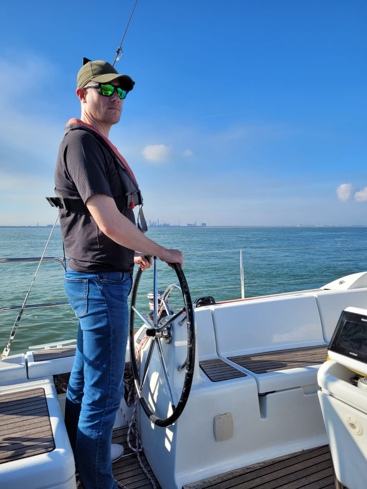

## About Me

Click [here](https://gijsvanhoutum.github.io/README) to learn more about me!

  
  

## Software Projects

Some of my public projects are listed below! Please take a look at them. Some include code, 
which is hosted on Github, others are not. All code related to work is confidential, 
therefore I am not able to share any of that. None of these projects are forked,
so only orignal stuff!

---
[(2023) TBD: Semi-Supervised Video Object Segmentation](/pdf/CV1.pdf)

---
[(2023) TBD: Domain shifts in Machine Learning](/pdf/CV1.pdf)

---
[(2022) ALSIM: Active Learning Simulator](/pdf/CV1.pdf)

---
[(2021) AWUS: Adaptive Weighted Uncertainty Sampling](/sample_page)

---
[(2020) MPORT: Modern Portfolio Theory at Scale](http://example.com/)

---
[(2020) CAMCAL: Self-supervised Camera calibration](http://example.com/)

---
[XIRIS_DAT: Binary Image File reader](https://github.com/gijsvanhoutum/xiris_dat)

  
  

---
[VBGT: Vision-based Deposition Geometry Detection](https://github.com/gijsvanhoutum/vbgt)

  
  

  
  

---
[ALAN: Algorithm Analyzer](https://github.com/gijsvanhoutum/alan)

  
  

---
[TREC: Threaded Video Player and Recorder](https://github.com/gijsvanhoutum/trec)

  
  

